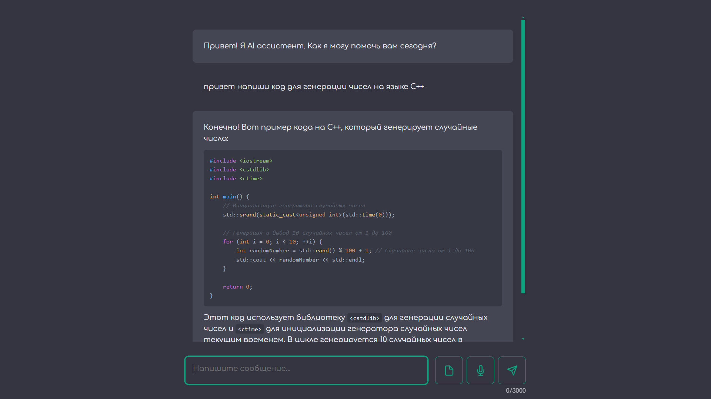

# ChatGPT-APP



Этот проект представляет собой простое веб-приложение, разработанное с использованием библиотеки `eel` и API `duckduckgo_search`. Приложение позволяет пользователю взаимодействовать с моделью чат-бота, генерируя ответы на основе введенных запросов.

## Благодарности

- **Eel**: Большое спасибо разработчикам библиотеки `eel` за создание удобного инструмента для создания веб-приложений с использованием Python. Библиотека значительно упрощает разработку и интеграцию веб-интерфейса с бэкендом на Python.

- **DuckDuckGo Search**: Спасибо команде `duckduckgo_search` за предоставление API, который позволяет использовать AI chat без использовании API key.

## Настройка модели

В файле `main.py` вы можете изменить модель, используемую для генерации ответов. По умолчанию используется модель `gpt-4o-min`. Чтобы изменить модель, измените строку:

```python
results = ddgs.chat(full_prompt)
```

Например, чтобы использовать модель `claude-3-haiku`, измените строку на:

```python
results = ddgs.chat(full_prompt, model='claude-3-haiku')
```

## Установка и запуск

1. Убедитесь, что у вас установлен Python 3.x.
2. Установите необходимые зависимости:

   ```bash
   pip install eel duckduckgo_search
   ```

3. Запустите приложение:

   ```bash
   python main.py
   ```

## Структура проекта

- `main.py`: Основной файл приложения, который содержит логику взаимодействия с моделью чат-бота.
- `web/`: Директория, содержащая веб-интерфейс приложения.
  - `index.html`: Основная страница веб-интерфейса.
  - `src`: Компоненты для index.html